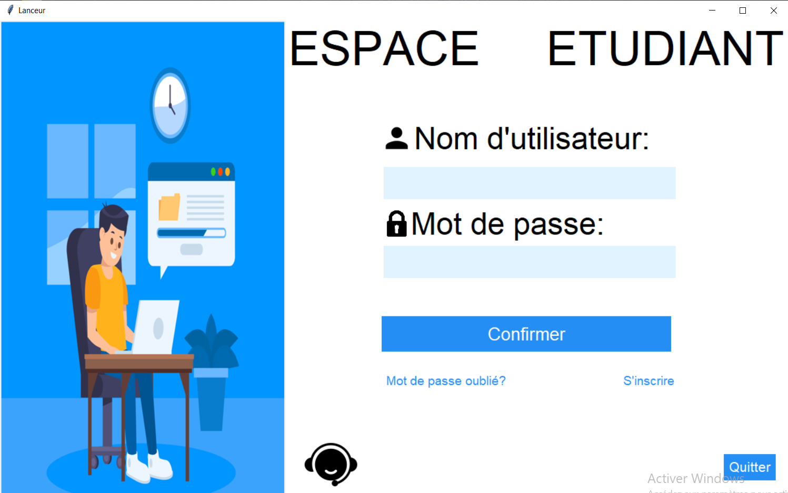

# School Management Project
This project is a simulation of a school student data management application using tkinter library.

# Title: Student Data Management Application

## Description:

The "Student Data Management Application" is a comprehensive and user-friendly desktop application designed to simulate a complete school student data management system. Created using the power of Python, this application serves as an indispensable tool for both students and educators by providing an organized platform to access, manage, and interact with various aspects of their academic journey.

## The app first interface:

## Key Features:

### Student-Centric Approach: 
This app places students at the center of their learning experience. With an intuitive user interface, students can easily navigate through a range of functionalities that cater to their educational needs.

### Lesson and Schedule Access:
Students can effortlessly access their lessons and schedules within the application. Whether it's viewing upcoming assignments, exam dates, or lecture materials, all the essential information is just a few clicks away.

### Professor Information:
The application provides students with detailed profiles of their professors. This allows students to learn more about their educators, facilitating a stronger student-teacher connection.

### Interactive GUI: 
The user interface is thoughtfully designed to provide a visually appealing experience. The user-friendly layout ensures that students can effortlessly navigate through the app's features, making it easy to find the information they need.

### Secure Data Storage:
The app employs a MySQL database to securely store student-related information. By seamlessly integrating Python with MySQL.

## Software requirements:
    - MySQL
    - Python (at least version 3.10)
    
## Packages used for Python:
    - tkinter
    - mysql.connector
    - webbrowser
    - os
    - PIL
    - subprocess
    - re
    - datetime
    - io

## Be careful 1:
    You need to set your local Mysql server database info to store the app data correctly.To do so, check the "School.py" file
    If u find a problem running the "School.exe" file, go ahead and just try running the main file which is 

## Be careful 2:
    Add the following two paths to the PATH environment variable in the system variables, in order to allow the correct execution of the "School.exe" files:

        -C:\Program Files\MySQL\MySQL Shell 8.0\bin
        -C:\Program Files\MySQL\MySQL Server 8.0\bin

    If you encounter any problems, please do not hesitate to contact us via email.
    Best regards.

    
# Made by:
    - AFKIR MOHAMED
    - AKKOUH LOKMANE
    - BEN TOUHAMI MOHAMED RIDA

